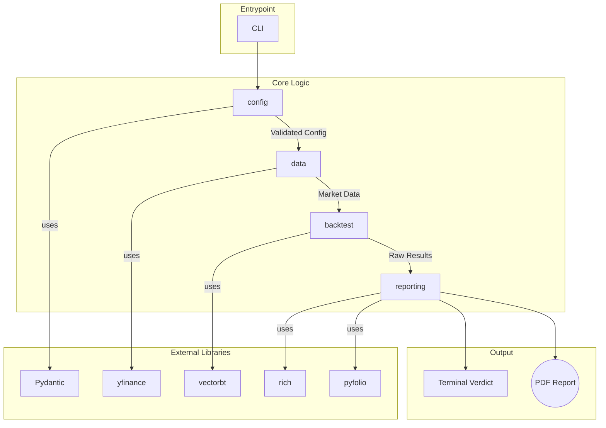
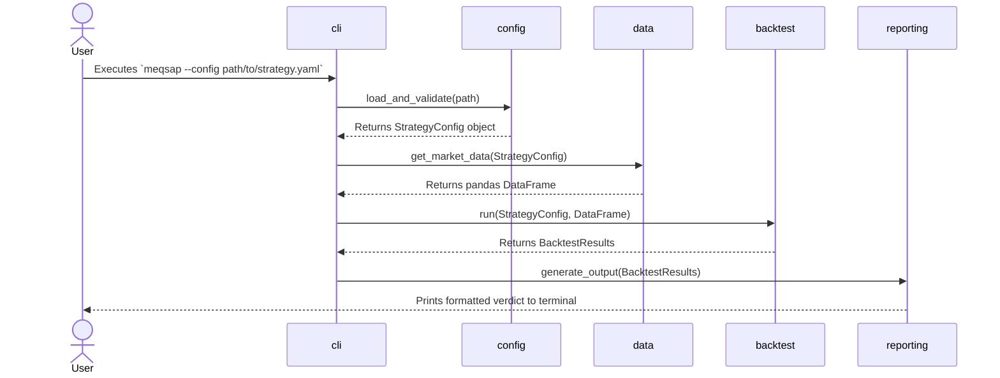

Of course. Here is the complete architecture document for MEQSAP in markdown format.

```markdown
# MEQSAP Architecture Document

## Technical Summary

This document outlines the architecture for the Minimum Viable Quantitative Strategy Analysis Pipeline (MEQSAP). The system is designed as a command-line tool that orchestrates a suite of powerful, existing Python libraries to provide an end-to-end backtesting and analysis workflow. It takes a simple YAML configuration file as input, runs a backtest, performs a series of validation and robustness checks, and presents a clear verdict in the terminal. The primary goal is to validate a high-level orchestration approach, prioritizing rapid development and reliability by leveraging battle-tested components like `vectorbt`, `pyfolio`, and `pydantic`.

## High-Level Overview

The MEQSAP application will be built as a **Monolithic** application contained within a **single repository**. This approach was chosen for the MVP to simplify development, dependency management, and deployment for a command-line tool.

The primary data flow is as follows:
1.  The user invokes the CLI, providing a path to a strategy `.yaml` file.
2.  The application loads and validates this configuration using a Pydantic schema.
3.  It then acquires historical market data via `yfinance`, utilizing a local file-based cache to speed up subsequent runs.
4.  The core backtesting engine, powered by `vectorbt`, processes the data and strategy rules to generate performance results.
5.  Finally, a presentation layer uses `rich` to display a formatted "Executive Verdict" in the terminal and can optionally generate a detailed PDF tear sheet with `pyfolio`.

```mermaid
graph TD
    subgraph "User Interaction"
        A[Strategist] --invokes--> B{MEQSAP CLI};
    end

    subgraph "MEQSAP Core Pipeline"
        B --.yaml config--> C[1. Load & Validate Config];
        C --uses--> D[Pydantic Schema];
        C --on success--> E[2. Acquire Data];
        E --checks--> F[(File Cache)];
        F --on miss--> G(yfinance API);
        G --stores--> F;
        F --provides data--> H[3. Run Backtest];
        E --provides data--> H;
        H --uses vectorbt--> I[Generate Signals & Stats];
        I --results--> J[4. Present Verdict & Report];
    end

    subgraph "Output"
        J --uses rich--> K[Formatted Terminal Verdict];
        J --'--report' flag & uses pyfolio--> L((PDF Tear Sheet));
    end
```

## Architectural / Design Patterns Adopted

The following high-level patterns have been chosen to guide the system's design and ensure the project's goals are met efficiently.

* **Pattern 1: Modular Monolith**
    * **Rationale:** The application is a single deployable unit (a monolith), which is ideal for a self-contained CLI tool. However, it will be internally structured into distinct modules with clear boundaries (e.g., `config`, `data`, `backtest`, `reporting`). This enforces a strong separation of concerns, making the codebase easier to maintain and test.

* **Pattern 2: Orchestration & Facade**
    * **Rationale:** This is the foundational principle of MEQSAP. The tool acts as a simplifying facade that provides a simple interface (the CLI and YAML file) to a complex subsystem of underlying libraries (`vectorbt`, `pyfolio`, etc.). This directly supports the primary objective of rapid, high-level development by orchestrating powerful, pre-existing components.

* **Pattern 3: Declarative Configuration**
    * **Rationale:** Users declare their strategy and its parameters in a `.yaml` file, defining *what* they want to test, not *how* to test it. The application is responsible for interpreting this configuration and executing the pipeline, which cleanly separates the strategy logic from the execution logic.

* **Pattern 4: Schema-Driven Validation (using Data Transfer Objects)**
    * **Rationale:** By using Pydantic to define a strict schema for the YAML configuration, we ensure all inputs are validated at the application's boundary. This pattern is crucial for providing immediate, clear error feedback and ensuring data integrity from the very start of the pipeline.

* **Pattern 5: Caching**
    * **Rationale:** To improve performance and avoid redundant API calls, a file-based cache for historical market data is explicitly required. This is a standard performance pattern that is essential for providing a fast, iterative user experience.

## Component View

The MEQSAP application is composed of the following primary modules, which collaborate to execute the backtesting pipeline:

* **`config` Module:** This module is responsible for loading the user's strategy `.yaml` file and validating its structure and values against a strict Pydantic schema.
* **`data` Module:** This module handles the acquisition and management of historical market data. It interfaces with `yfinance`, performs data integrity checks, and manages the file-based caching system to ensure efficiency.
* **`backtest` Module:** This is the core engine of the application. It takes the prepared data and strategy configuration, generates trading signals (using `pandas-ta`), executes the backtest (using `vectorbt`), and runs the required robustness "Vibe Checks" (e.g., high fees, trade count).
* **`reporting` Module:** This module takes the raw results from the `backtest` module and is responsible for all user-facing output. It generates the formatted "Executive Verdict" table for the terminal (using `rich`) and compiles the comprehensive PDF report when requested (using `pyfolio`).
* **`cli` Module:** This module serves as the application's main entry point. It handles parsing command-line arguments (e.g., `--report`, `--verbose`) and orchestrates the workflow by calling the other modules in the correct sequence.

This component-based structure is visualized below:



## Project Structure

The project will be organized using a standard `src` layout to cleanly separate the installable Python package from other project files like tests, documentation, and configuration.

```plaintext
meqsap/
├── .github/
│   └── workflows/
│       └── main.yml            # CI/CD pipeline for testing and publishing to PyPI
├── .venv/                      # Python virtual environment directory (git-ignored)
├── docs/
│   ├── adr/                          # Architectural Decision Records
│   │   ├── 004-error-handling-policy.md # Example ADR file
│   │   └── ...                         # Other ADR files
│   ├── policies/                     # Policy documents
│   │   └── error-handling-policy.md    # Example Policy file
│   ├── architecture.md               # This architecture document
│   └── ...                           # Other documentation (prd.md, etc.)
├── examples/                         # Example strategy configurations
│   └── ma_crossover.yaml        # Example Moving Average Crossover config
├── src/
│   └── meqsap/                 # The main installable Python package
│       ├── __init__.py
│       ├── backtest.py         # Core backtesting and vibe check logic
│       ├── cli.py              # Main CLI entrypoint and command parsing
│       ├── config.py           # Pydantic schema and YAML loading
│       ├── data.py             # Data acquisition and caching logic
│       ├── exceptions.py             # Custom application exceptions
│       ├── reporting.py        # Terminal output and PDF generation
│       └── py.typed            # PEP 561 marker to indicate type hints are supported
├── tests/
│   ├── __init__.py
│   ├── test_backtest.py
│   ├── test_config.py
│   └── ...                       # Tests mirroring the application package structure
├── .gitignore
├── pyproject.toml                # Defines project metadata for packaging (for PyPI)
├── README.md                     # Project overview and setup instructions
└── requirements.txt              # Frozen project dependencies for reproducibility
```

### Key Directory Descriptions

* **`docs/`**: Contains all project planning and reference documentation, including this architecture document.
* **`src/meqsap/`**: This is the main Python package that will be installed by `pip`. It contains all application source code, with each logical component from our "Component View" represented as a separate Python module (`.py` file).
* **`tests/`**: Contains all automated tests. The structure of this directory will mirror the `src/meqsap` package to ensure clear organization.
* **`pyproject.toml`**: The standard file for configuring a Python project's metadata, build dependencies, and defining the CLI entry point for packaging. This is essential for publishing to PyPI.
* **`requirements.txt`**: This file will list the exact, frozen versions of all project dependencies, ensuring a completely reproducible environment as required by the non-functional requirements.

## Definitive Tech Stack Selections

| Category             | Technology      | Version / Details | Description / Purpose                                                   | Justification (Optional)                                                  |
| :------------------- | :-------------- | :---------------- | :---------------------------------------------------------------------- | :------------------------------------------------------------------------ |
| **Languages** | Python          | 3.9+              | Primary language for the entire application.                           | Specified in project requirements.                                        |
| **CLI Framework** | Typer           | Latest            | For building a robust and user-friendly command-line interface.         | Integrates well with Pydantic and provides modern features like auto-completion. |
| **Data Handling** | pandas          | Latest            | Core data manipulation and analysis.                                   | Industry standard for data science in Python.                             |
|                      | yfinance        | Latest            | To download historical OHLCV data.                                     | Meets the project's data source requirement.                              |
| **Technical Analysis** | pandas-ta       | Latest            | To generate technical analysis indicators like moving averages.       | A comprehensive and widely used library for TA.                           |
| **Backtesting** | vectorbt        | Latest            | Core library for running fast, vectorized backtests.                   | A powerful, modern library that is central to the project's objective.    |
| **Configuration** | PyYAML          | Latest            | To securely load the strategy `.yaml` configuration file.              | Standard and secure library for YAML parsing.                             |
|                      | Pydantic        | Latest            | For defining a strict schema and validating the user's configuration. | Enforces data integrity and provides clear validation errors.             |
| **Reporting & UI** | rich            | Latest            | To display formatted tables and text in the terminal.                  | Creates a polished and readable user experience in the CLI.               |
|                      | pyfolio         | Latest            | To generate institutional-grade PDF tear sheets for analysis.         | Industry standard for performance and risk analysis reporting.            |
| **Testing** | pytest          | Latest            | Framework for writing and running unit and integration tests.           | De facto standard for testing in the Python ecosystem.                    |
| **CI/CD** | GitHub Actions  | N/A               | To automate testing and publishing to PyPI.                             | Well-integrated solution for projects hosted on GitHub.                   |

## API Reference

### External APIs Consumed

This application consumes data from one external service via its Python library wrapper.

* **`yfinance` API**
    * **Purpose:** To acquire historical OHLCV (Open, High, Low, Close, Volume) market data for specified stock tickers.
    * **Consumption Method:** The API is not a direct REST API but is consumed via the `yfinance` Python library.
    * **Authentication:** Not required for public historical data.
    * **Key Functions Used:** The primary function will be `yfinance.download()`.
    * **Rate Limits:** While not explicitly defined by the library, usage is subject to Yahoo! Finance's terms of service and may be subject to throttling if abused. The application's caching mechanism is designed to mitigate this.
    * **Link to Official Docs:** [https://pypi.org/project/yfinance/](https://pypi.org/project/yfinance/)

### Internal APIs Provided (If Applicable)

Not applicable. As a self-contained command-line tool, MEQSAP does not provide any network APIs for other services to consume.

## Data Models

This section defines the core data structures the application works with. For MEQSAP, the primary data model is the strategy configuration provided by the user.

### Core Application Entities / Domain Objects

* **`StrategyConfig`**
    * **Description:** This entity represents the complete configuration for a single backtest run, as loaded from the user's `.yaml` file. It is validated by Pydantic to ensure all parameters are correct before the pipeline begins.
    * **Schema / Pydantic Definition (Example for a Moving Average Crossover):**
        ```python
        from pydantic import BaseModel, Field, validator

        class MovingAverageCrossoverParams(BaseModel):
            fast_ma: int = Field(..., gt=0)
            slow_ma: int = Field(..., gt=0)

            @validator('slow_ma')
            def slow_ma_must_be_greater_than_fast_ma(cls, v, values):
                if 'fast_ma' in values and v <= values['fast_ma']:
                    raise ValueError('slow_ma must be greater than fast_ma')
                return v

        class StrategyConfig(BaseModel):
            ticker: str
            start_date: str
            end_date: str
            strategy_name: str = "MovingAverageCrossover"
            strategy_params: MovingAverageCrossoverParams
        ```
    * **Validation Rules:** Validation is handled directly within the Pydantic models, as shown with the `@validator` decorator. This ensures rules like `slow_ma > fast_ma` are enforced.

### Database Schemas (If applicable)

Not applicable. The application does not use a database for its operations.

## Core Workflow / Sequence Diagrams

This sequence diagram illustrates the interactions between the logical components defined in the "Component View" during a typical run.



## Coding Standards

These standards are mandatory for all code to ensure consistency and maintainability.

* **Naming Conventions:**
    * Variables & Functions: `snake_case` (e.g., `market_data`, `run_backtest`).
    * Classes: `PascalCase` (e.g., `StrategyConfig`).
    * Constants: `UPPER_SNAKE_CASE` (e.g., `CACHE_DIR`).
* **Type Safety:**
    * As per the requirements, the entire codebase **must** use Python's native type hints.
    * `mypy` will be used for static type checking to enforce type safety.
* **Dependency Management:**
    * All project dependencies **must** be explicitly defined and frozen in `requirements.txt` to ensure a completely reproducible environment.
* **Logging:**
    * The built-in `logging` module will be used. Standard logs will be at the `INFO` level, with detailed debugging information available via the `--verbose` flag.

## Overall Testing Strategy

The testing approach will focus exclusively on the custom logic written for MEQSAP, not the internal functionality of third-party libraries.

* **Tools:** `pytest` will be the primary framework for all tests.
* **Unit Tests:**
    * **Scope:** Tests will validate our custom orchestration logic. We will not test the internal calculations of libraries like `vectorbt` or `pyfolio`. For example, a test for our `data` module will mock the call to `yfinance` and verify that our caching logic works as expected. A test for our `backtest` module will ensure our code correctly prepares data and calls the `vectorbt` functions with the right arguments.
    * **Location:** Reside in the top-level `tests/` directory.
* **Integration Tests:**
    * **Scope:** Test the interaction and data flow between our custom modules (e.g., ensuring the `StrategyConfig` object from the `config` module is correctly passed to and used by the `data` and `backtest` modules).
* **End-to-End (E2E) Tests:**
    * **Scope:** Validate the complete application flow from the command line. These tests will execute the `meqsap` command with arguments and verify that the terminal output is generated correctly and that files (like a PDF report) are created successfully.

## Security Best Practices

Even for a single-user tool, following basic best practices ensures robustness and safety.

* **Robust Input Validation:** All configurations from the `.yaml` file will be strictly validated by Pydantic models at the start of any process. This prevents errors from malformed input.
* **Safe Configuration Parsing:** The system **must** use `yaml.safe_load()` to parse `.yaml` files. This is a critical practice to prevent the execution of arbitrary code from a potentially untrusted configuration file.
```