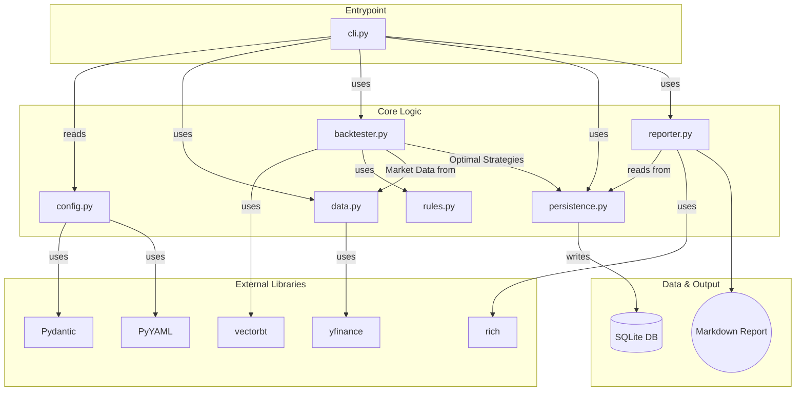

# KISS Signal CLI v1.4 Architecture Document

> **Status:** Revised 2025-06-14  
> **Change Scope:** Incorporates the full set of review recommendations, adjusted per the owner’s comments.  
> • One-command hobby project, no cron/CI jobs  
> • No hard LoC cap, but code should remain minimal and boring  
> • Focus universe = Indian large-cap & mid-cap equities  
> • `rich` is mandatory  
> • No automated formatting or security hardening  
> • “Not-to-do” list called out explicitly at the end  

---

## Technical Summary

This document outlines the architecture for the **KISS Signal CLI v1.4**.  
The system is a single-executable command-line tool that:

* Reads two YAML files (`config.yaml` parameters, `rules.yaml` logic).  
* Discovers the **optimal rule stack** for each ticker in the Indian large-cap / mid-cap universe (NSE).  
* Runs that strategy on the most recent, **corporate-action-adjusted** EOD data.  
* Stores prices, optimal rule stacks, and trade life-cycle events in a local SQLite database.  
* Emits a clear Markdown report for the day.

The design follows a **modular monolith** philosophy: one repository, one binary entry-point, well-defined internal modules, minimal surface area, no external services beyond the NSE data feed.

---

## High-Level Overview

The **only interaction** is the user running:

```bash
quickedge run [--verbose] [--freeze-data YYYY-MM-DD]
```

Or directly with Python:

```bash
python run.py run [--verbose] [--freeze-data YYYY-MM-DD]
```

A frozen-data flag pins the run to a deterministic snapshot if the user wants repeatability.  
This project is deliberately **not** intended for cron jobs, CI pipelines, or multi-user concurrency.

```mermaid
graph TD
    subgraph "User Interaction"
    A[Trader] --invokes--> B{KISS Signal CLI}
    end

    subgraph "KISS Signal Core Pipeline"
    B --'quickedge run'--> C[1. Load & Validate Config]
    C --reads--> D[config.yaml & rules.yaml]
    C --on success--> E[2. Acquire Data]
    E --checks--> F[(File Cache)]
    F --on miss--> G(yfinance API)
    G --stores--> F
    F --provides data--> H[3. Discover Optimal Strategy]
    E --provides data--> H
    H --uses vectorbt--> I[Iterative Backtesting]
    I --optimal strategy--> J[4. Persist Strategy]
    J --writes to--> K[(SQLite DB)]
    H --latest data & optimal strategy--> L[5. Generate Signals]
    L --new signals--> M[6. Persist Trades]
    M --writes to--> K
    L --triggers--> N[7. Generate Report]
    N --reads from--> K
    end

    subgraph "Output"
    N --writes--> O((signals_YYYY-MM-DD.md))
    end
```

*All alternate/error paths (API failure, cache flush, DB lock) raise explicit CLI exceptions and abort cleanly; no silent retries are attempted.*

---

## Architectural / Design Patterns Adopted

| # | Pattern | Notes & Rationale |
|---|---------|------------------|
| 1 | **Modular Monolith** | One deployable unit is simpler for a personal hobby project. Internally segmented into small modules (`data_manager`, `backtester`, `rule_funcs`, `reporter`, `persistence`). No hard 1 000-LoC limit, but every addition must justify itself. |
| 2 | **Orchestration & Facade** | The `cli.py` module orchestrates calls to other modules (`data`, `backtester`, `persistence`, `reporter`) and acts as a thin façade over heavy libraries (`vectorbt`, `pandas`, `rich`). |
| 3 | **Declarative Configuration** | `config.yaml` and `rules.yaml` describe *what* to do. Execution logic lives in code. |
| 4 | **Data Persistence (Denormalized)** | Two main tables: `strategies` and `positions`. The `strategies` table stores the full rule definition as a JSON string, making each record self-contained and avoiding complex joins. |
| 5 | **File-based Caching (Hash-validated)** | Historical data cached as CSV + SHA-256 checksum. `--refresh-cache` flag forces invalidation. |
| 6 | **Deterministic Snapshot Option** | `--freeze-data YYYY-MM-DD` instructs the CLI to ignore any newer price updates, guaranteeing reproducible results. |

---

## Component View



---

## Project Structure

```plaintext
kiss-signal-cli/
├── docs/
│   └── architecture.md   # This file
├── data/
│   └── nifty_large_mid.csv  # NSE large- & mid-cap universe
├── src/
│   └── kiss_signal/
│       ├── __init__.py
│       ├── backtester.py
│       ├── cli.py
│       ├── config.py
│       ├── data.py
│       ├── persistence.py
│       ├── rules.py            # Implementation of indicator/helper functions
│       └── reporter.py
├── tests/
│   ├── test_backtester.py
│   ├── test_report_golden.py   # Markdown golden-file comparison
│   └── benchmarks/
│       └── test_perf_60_tickers.py
├── .gitignore
├── config.yaml
├── rules.yaml
├── pyproject.toml
└── README.md
```

---

## Definitive Tech Stack Selections

| Category | Technology | Details | Purpose |
|----------|------------|---------|---------|
| **Language** | Python | 3.11+ | Entire codebase |
| **CLI Framework** | Typer | Latest | Sub-command & flag parsing |
| **Terminal UI** | rich | Latest (mandatory) | Progress bars, tables |
| **Data Handling** | pandas | Latest | Data wrangling |
| | yfinance | Latest | NSE EOD data download |
| **Backtesting** | vectorbt | Latest | Fast vectorised indicator calc |
| **Config** | PyYAML | Latest (`safe_load`) | YAML parsing |
| | Pydantic | Latest v2 | Schema validation |
| **Database** | sqlite3 | stdlib (WAL mode) | Local persistence |
| **Testing** | pytest + pytest-benchmark | Latest | Unit, E2E, perf tests |

---

## Data Models

### Configuration (Pydantic)

```python
from pydantic import BaseModel, Field, field_validator
from typing import List, Dict

class EdgeScoreWeights(BaseModel):
    win_pct: float = Field(..., ge=0, le=1)
    sharpe: float = Field(..., ge=0, le=1)

    @field_validator("sharpe")
    def _weights_sum_to_one(cls, v, values):
        assert (v + values["win_pct"]) == 1.0, "weights must sum to 1"
        return v

class Config(BaseModel):
    universe_path: str
    hold_period: int = Field(..., gt=0)
    min_trades_threshold: int = Field(..., ge=0)
    edge_score_weights: EdgeScoreWeights
```

### Database Schema (SQLite, Denormalized)

```sql
-- Stores optimal strategies found during a backtest run.
CREATE TABLE strategies (
    id INTEGER PRIMARY KEY AUTOINCREMENT,
    symbol TEXT NOT NULL,
    run_timestamp TEXT NOT NULL,
    rule_stack TEXT NOT NULL, -- Full rule definition stored as JSON
    edge_score REAL NOT NULL,
    win_pct REAL NOT NULL,
    sharpe REAL NOT NULL,
    total_trades INTEGER NOT NULL,
    avg_return REAL NOT NULL,
    created_at TEXT DEFAULT CURRENT_TIMESTAMP,
    UNIQUE(symbol, rule_stack, run_timestamp)
);

-- Tracks the lifecycle of individual trade positions.
CREATE TABLE positions (
  id              INTEGER PRIMARY KEY AUTOINCREMENT,
  symbol          TEXT NOT NULL,
  entry_date      TEXT NOT NULL,
  entry_price     REAL,
  exit_date       TEXT,
  exit_price      REAL,
  status          TEXT NOT NULL CHECK(status IN ('OPEN', 'CLOSED')),
  rule_stack_used TEXT NOT NULL, -- Full rule definition stored as JSON
  final_return_pct REAL,
  final_nifty_return_pct REAL,
  days_held       INTEGER,
  created_at      TEXT DEFAULT CURRENT_TIMESTAMP
);
```

*The `reporter` module reads from the `strategies` and `positions` tables to generate daily reports.*

---

## Core Workflow / Sequence Diagram


---

## Coding Standards

* **Naming:** `snake_case` for vars/functions, `PascalCase` for classes, `UPPER_SNAKE` for constants.  
* **Type Hints:** 100 % coverage, checked with `mypy`.  
* **Logging:** Use built-in `logging`, default level `INFO`; `--verbose` sets `DEBUG` and writes `run_log_<date>.txt`.  
* **Style:** No enforced formatter (black, isort, pre-commit) – rely on disciplined manual formatting.  
* **Code Volume:** No explicit LoC ceiling, but every new line must serve a clear purpose; avoid clever abstractions.

---

## Overall Testing Strategy

* **Unit Tests**: Each core module; DB tests run on an in-memory SQLite connection.  
* **Integration Tests**: End-to-end invocation comparing output Markdown against a golden file.  
* **Performance Benchmark**: `pytest-benchmark` test ensures a 60-ticker run completes within an empirically acceptable window on reference hardware (document the number).  
* **No Security Tests**: Not required for single-user local execution.

---

## Roadmap – Post-MVP Features

* AI Strategy Improver  
* Dynamic Exit Conditions  
* Equal-risk ATR position sizing  
* Short-side rule stacks  
* Sector rotation overlay  
* Adaptive exit optimisation  
* Opt-in e-mail / Telegram alerts  

---

## Explicit **Not-to-Do** List

1. No cron jobs, CI pipelines, or multi-user support.  
2. No GUI, web dashboard, or external DB engines.  
3. No options, futures, or intraday data; EOD only.  
4. No deep-learning or opaque “AI” black boxes.  
5. No automatic code formatters (black, isort, pre-commit).  
6. No explicit security hardening or supply-chain scanning.  
7. No packaging for public distribution (PyPI); run directly from source.  
8. No duplicate storage of derived metrics in the `trades` table.  
9. No support for non-Indian instruments or micro/small-cap stocks.  

---

*End of document.*
