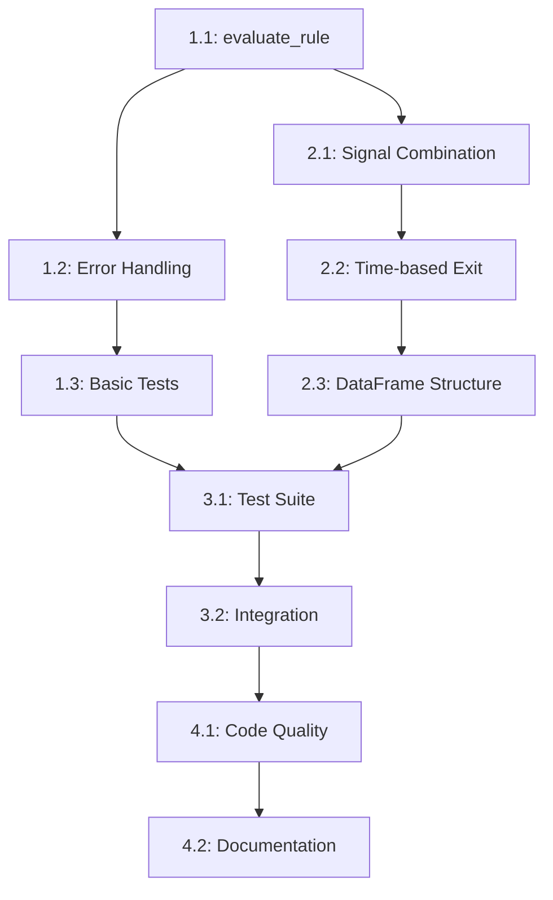

# Story 006: Implement Signal Generation

## Status: 🚧 READY FOR DEVELOPMENT

**Priority:** HIGH  
**Estimated Story Points:** 6  
**Prerequisites:** Story 005 (Implement Backtesting Engine) ✅ Complete  
**Created:** 2025-06-19

## User Story
As a technical trader, I want the signal generation module implemented so that the system can generate actual buy/sell signals using the optimal rule combinations discovered by the backtesting engine.

## Context & Rationale
This story implements the signal generation capability that transforms optimal strategies into actionable trading signals. The signal generator uses rule combinations identified by the backtester and applies them to current market data to generate timely buy signals with appropriate exit timing.

**Current State:**
- ✅ Data layer complete (Stories 002-004)
- ✅ Rule functions complete (Story 003)  
- ✅ Backtester complete with strategy discovery (Story 005, 84% coverage)
- ⚠️ Signal Generator module exists but 0% implementation (32/32 statements missing)
- ❌ No tests exist for signal generation

**Architecture Impact:**
- Enables the workflow: Data → Strategy Discovery → **Signal Generation** → Persistence → Reporting
- Required before implementing persistence layer (which stores generated signals)
- Central to converting backtested strategies into live trading actions

## Problem Analysis

### Current Signal Generator Module
The `signal_generator.py` file exists but contains only:
- Class structure with TODOs
- Empty `generate_signals()` method 
- Empty `evaluate_rule()` method
- 0% test coverage (32/32 statements missing)

### Key Requirements from Architecture
1. **Rule Evaluation:** Apply individual rules (SMA crossover, RSI oversold, EMA crossover) to price data
2. **Signal Combination:** Combine multiple rules using AND logic for entry signals
3. **Time-based Exit:** Generate sell signals after configurable hold period (default 20 days)
4. **Signal Metadata:** Include timestamps, rule stack used, and signal strength indicators
5. **Integration:** Work seamlessly with backtester output and persistence layer

### Technical Implementation Scope
- Implement `evaluate_rule()` method for individual rule evaluation
- Implement `generate_signals()` method for rule combination and signal generation
- Add time-based exit signal generation after hold period
- Create comprehensive test suite with fixtures
- Ensure type safety with full type hints

## Acceptance Criteria

### Core Functionality
- [ ] **AC1:** `evaluate_rule()` method correctly evaluates individual rules against price data
  - [ ] AC1.1: Handles `sma_crossover` rule evaluation  
  - [ ] AC1.2: Handles `rsi_oversold` rule evaluation
  - [ ] AC1.3: Handles `ema_crossover` rule evaluation
  - [ ] AC1.4: Returns boolean Series indicating signal conditions
  - [ ] AC1.5: Handles invalid rule names gracefully

- [ ] **AC2:** `generate_signals()` method produces actionable trading signals
  - [ ] AC2.1: Combines multiple rules using AND logic for buy signals
  - [ ] AC2.2: Generates time-based sell signals after hold period
  - [ ] AC2.3: Returns DataFrame with proper signal structure (timestamp, signal_type, metadata)
  - [ ] AC2.4: Handles empty rule stacks gracefully
  - [ ] AC2.5: Logs signal generation activity appropriately

- [ ] **AC3:** Signal output structure matches architecture requirements
  - [ ] AC3.1: Buy signals include timestamp, symbol, rule_stack, signal_strength
  - [ ] AC3.2: Sell signals include timestamp, symbol, exit_reason (time-based)
  - [ ] AC3.3: Signal DataFrame has proper column types and indexing
  - [ ] AC3.4: No duplicate signals for same timestamp/symbol

### Integration & Quality
- [ ] **AC4:** Integration with existing modules works correctly
  - [ ] AC4.1: Accepts backtester rule stack output format
  - [ ] AC4.2: Uses rule functions from `rules.py` module
  - [ ] AC4.3: Handles real price data from data layer
  - [ ] AC4.4: Prepares signals for persistence layer consumption

- [ ] **AC5:** Error handling and edge cases covered
  - [ ] AC5.1: Handles missing or invalid price data
  - [ ] AC5.2: Manages insufficient data for rule evaluation
  - [ ] AC5.3: Graceful degradation for rule evaluation failures
  - [ ] AC5.4: Proper logging for debugging and monitoring

- [ ] **AC6:** Test coverage and code quality standards met
  - [ ] AC6.1: ≥85% test coverage on `signal_generator.py`
  - [ ] AC6.2: All methods have comprehensive unit tests
  - [ ] AC6.3: Integration tests with real data fixtures
  - [ ] AC6.4: MyPy strict mode compliance with full type hints
  - [ ] AC6.5: Performance tests for reasonable execution time

## Technical Design

### Method Signatures
```python
class SignalGenerator:
    def __init__(self, rules_config: Dict[str, Any], hold_period: int = 20) -> None:
        """Initialize with rules configuration and hold period."""
    
    def generate_signals(self, symbol: str, price_data: pd.DataFrame, 
                        rule_stack: List[str]) -> pd.DataFrame:
        """Generate buy/sell signals using rule stack.
        
        Returns:
            DataFrame with columns: [timestamp, signal_type, symbol, 
                                   rule_stack, metadata]
        """
    
    def evaluate_rule(self, rule_name: str, price_data: pd.DataFrame) -> pd.Series:
        """Evaluate single rule against price data.
        
        Returns:
            Boolean Series indicating signal conditions
        """
```

### Signal DataFrame Schema
```python
# Output format for generate_signals()
{
    'timestamp': datetime,      # When signal occurred
    'signal_type': str,         # 'BUY' or 'SELL'  
    'symbol': str,              # NSE symbol
    'rule_stack': List[str],    # Rules that triggered signal
    'metadata': Dict[str, Any]  # Additional signal context
}
```

### Implementation Approach
1. **Rule Evaluation Engine:** Map rule names to functions in `rules.py`
2. **AND Logic Combination:** All rules in stack must trigger for buy signal
3. **Time-based Exit:** Track buy signals and generate sells after hold period
4. **Signal Deduplication:** Prevent duplicate signals for same timestamp/symbol
5. **Error Resilience:** Handle missing data and rule evaluation failures

## Testing Strategy

### Test File: `tests/test_signal_generator.py`
```python
class TestSignalGenerator:
    # Basic functionality tests
    def test_init_default_parameters()
    def test_init_custom_hold_period()
    
    # Rule evaluation tests  
    def test_evaluate_rule_sma_crossover()
    def test_evaluate_rule_rsi_oversold()
    def test_evaluate_rule_ema_crossover()
    def test_evaluate_rule_invalid_name()
    def test_evaluate_rule_insufficient_data()
    
    # Signal generation tests
    def test_generate_signals_single_rule()
    def test_generate_signals_multiple_rules_and_logic()
    def test_generate_signals_time_based_exit()
    def test_generate_signals_empty_rule_stack()
    def test_generate_signals_no_triggers()
    
    # Integration tests
    def test_integration_with_backtester_output()
    def test_integration_with_real_price_data()
    
    # Edge cases
    def test_missing_price_data()
    def test_malformed_rule_stack()
    def test_signal_deduplication()

class TestSignalGeneratorFixtures:
    def test_sample_signal_data_fixture()
```

### Test Data Requirements
- Sample price data CSV files (reuse from existing fixtures)
- Mock rule configurations matching `rules.yaml` format
- Expected signal outputs for validation

## Definition of Done

### Functional Requirements
- [ ] All acceptance criteria validated with automated tests
- [ ] `generate_signals()` produces signals matching expected schema
- [ ] Rule evaluation works for all supported rule types
- [ ] Time-based exit signals generated correctly
- [ ] Integration with backtester output confirmed

### Quality Requirements  
- [ ] ≥85% test coverage on `signal_generator.py` module
- [ ] All tests pass: `pytest tests/test_signal_generator.py -v`
- [ ] MyPy passes: `mypy src/kiss_signal/signal_generator.py --strict`
- [ ] Performance acceptable: signals generated in <1 second for typical dataset
- [ ] Code follows KISS principles: minimal complexity, clear logic

### Integration Requirements
- [ ] CLI integration maintained: `python run.py run --verbose` still works
- [ ] No breaking changes to existing modules
- [ ] Logging outputs provide useful debugging information
- [ ] Memory usage remains reasonable for large datasets

### Documentation Requirements
- [ ] All public methods have clear docstrings
- [ ] Type hints present on all method signatures
- [ ] Implementation comments for complex logic
- [ ] Signal output schema documented

## Notes & Constraints

### Implementation Notes
- **Rule Function Mapping:** Use existing functions from `rules.py` module
- **Performance:** Vectorized operations preferred over loops where possible  
- **Error Handling:** Log errors but don't crash; return empty DataFrames on failure
- **Signal Timing:** Use end-of-day timestamps for signal generation
- **Hold Period:** Configurable but defaults to 20 days per architecture

### Architecture Constraints
- **No New Dependencies:** Use existing stack (pandas, vectorbt, logging)
- **Module Boundaries:** Keep signal generation logic in `signal_generator.py`
- **Database Preparation:** Signal format must work with future persistence layer
- **KISS Principle:** Simple, readable implementation over premature optimization

### Development Readiness
- [x] **Clear Acceptance Criteria:** Specific, testable requirements
- [x] **Implementation Guidance:** Method signatures and approach provided
- [x] **Test Strategy:** Test file structure specified  
- [x] **Success Metrics:** Quantifiable completion criteria

This story is ready for development approval.

## Detailed Implementation Tasks

### Phase 1: Core Rule Evaluation Engine
**Estimated: 2 story points**

#### Task 1.1: Implement `evaluate_rule()` Method (1.0 SP)
- [ ] **1.1.1:** Create rule name to function mapping dictionary
  - Map "sma_crossover" → `sma_crossover` function from `rules.py`
  - Map "rsi_oversold" → `rsi_oversold` function from `rules.py`
  - Map "ema_crossover" → `ema_crossover` function from `rules.py`
- [ ] **1.1.2:** Implement rule parameter extraction from `rules_config`
  - Parse rule parameters from YAML configuration
  - Handle missing parameters with sensible defaults
  - Validate parameter types and ranges
- [ ] **1.1.3:** Add rule function invocation with error handling
  - Call appropriate rule function with price data and parameters
  - Catch and log rule evaluation errors
  - Return empty Series on failure with warning
- [ ] **1.1.4:** Implement return value standardization
  - Ensure all rule functions return boolean Series
  - Handle different return formats gracefully
  - Add input validation for price data structure

#### Task 1.2: Add Rule Evaluation Error Handling (0.5 SP)
- [ ] **1.2.1:** Handle invalid rule names
  - Log warning for unknown rule names
  - Return Series of False values for invalid rules
  - Add comprehensive error messages
- [ ] **1.2.2:** Handle insufficient price data
  - Check minimum data requirements per rule type
  - Return appropriate error responses
  - Log data quality issues
- [ ] **1.2.3:** Add rule evaluation logging
  - Log successful rule evaluations with debug level
  - Log failures with warning level
  - Include rule name and data size in logs

#### Task 1.3: Create Basic Rule Evaluation Tests (0.5 SP)
- [ ] **1.3.1:** Test valid rule evaluations
  - Test each supported rule type with sample data
  - Verify correct boolean Series output
  - Test with different parameter combinations
- [ ] **1.3.2:** Test error conditions
  - Invalid rule names
  - Insufficient data scenarios
  - Malformed price data
- [ ] **1.3.3:** Create test fixtures
  - Sample price data for rule testing
  - Mock rules configuration
  - Expected rule evaluation outputs

### Phase 2: Signal Generation Logic
**Estimated: 2.5 story points**

#### Task 2.1: Implement Signal Combination Logic (1.0 SP)
- [ ] **2.1.1:** Create rule stack evaluation engine
  - Evaluate all rules in the stack against price data
  - Combine rule results using AND logic
  - Handle empty rule stacks gracefully
- [ ] **2.1.2:** Implement buy signal generation
  - Identify timestamps where all rules trigger
  - Create signal records with proper metadata
  - Add signal strength calculation (percentage of rules triggered)
- [ ] **2.1.3:** Add signal deduplication logic
  - Prevent duplicate signals for same timestamp/symbol
  - Handle overlapping signal conditions
  - Maintain signal chronological order

#### Task 2.2: Implement Time-based Exit Strategy (1.0 SP)
- [ ] **2.2.1:** Create buy signal tracking
  - Store active buy signals with entry timestamps
  - Track holding period for each position
  - Handle multiple concurrent positions per symbol
- [ ] **2.2.2:** Generate sell signals after hold period
  - Calculate exit dates based on configurable hold period
  - Create sell signal records with exit metadata
  - Handle weekends and market holidays appropriately
- [ ] **2.2.3:** Implement signal lifecycle management
  - Link buy and sell signals for position tracking
  - Clean up expired tracking data
  - Handle early exit conditions if needed

#### Task 2.3: Create Signal DataFrame Structure (0.5 SP)
- [ ] **2.3.1:** Define signal output schema
  - Implement standardized DataFrame columns
  - Add proper data types and indexing
  - Include all required metadata fields
- [ ] **2.3.2:** Implement signal formatting
  - Convert internal signal objects to DataFrame
  - Ensure consistent timestamp formatting
  - Add signal validation before return
- [ ] **2.3.3:** Add signal metadata enrichment
  - Include rule stack information in metadata
  - Add signal confidence/strength indicators
  - Include price context at signal time

### Phase 3: Integration & Testing
**Estimated: 1.5 story points**

#### Task 3.1: Create Comprehensive Test Suite (1.0 SP)
- [ ] **3.1.1:** Unit tests for `SignalGenerator` class
  - Test initialization with various configurations
  - Test rule evaluation with mock data
  - Test signal generation with known inputs
- [ ] **3.1.2:** Integration tests with real data
  - Test with actual price data from fixtures
  - Test with backtester output format
  - Verify signal quality and timing
- [ ] **3.1.3:** Performance and edge case tests
  - Test with large datasets (performance)
  - Test with minimal data (edge cases)
  - Test memory usage and execution time
- [ ] **3.1.4:** Create test fixtures and helpers
  - Sample signal generation scenarios
  - Mock rule configurations
  - Expected output validation data

#### Task 3.2: Integration with Existing Modules (0.5 SP)
- [ ] **3.2.1:** Verify backtester output compatibility
  - Test signal generator with actual backtester results
  - Ensure rule stack format matches expectations
  - Test end-to-end workflow integration
- [ ] **3.2.2:** Prepare for persistence layer integration
  - Verify signal output format meets persistence requirements
  - Test signal serialization/deserialization
  - Ensure database-ready signal structure
- [ ] **3.2.3:** Update CLI integration
  - Ensure signal generation works in CLI context
  - Test verbose logging output
  - Verify error handling in CLI environment

### Phase 4: Quality Assurance & Documentation
**Estimated: 1.0 story point**

#### Task 4.1: Code Quality & Type Safety (0.5 SP)
- [ ] **4.1.1:** Add comprehensive type hints
  - Full type annotations for all methods
  - Generic types for DataFrame operations
  - Union types for optional parameters
- [ ] **4.1.2:** MyPy strict mode compliance
  - Fix all MyPy warnings and errors
  - Add type ignores only where necessary
  - Test with strict mode enabled
- [ ] **4.1.3:** Code review and refactoring
  - Ensure KISS principles compliance
  - Optimize for readability over performance
  - Remove any unnecessary complexity

#### Task 4.2: Documentation & Logging (0.5 SP)
- [ ] **4.2.1:** Complete method docstrings
  - Add detailed parameter descriptions
  - Include return value specifications
  - Add usage examples where helpful
- [ ] **4.2.2:** Enhance logging throughout module
  - Add appropriate log levels (debug, info, warning)
  - Include useful context in log messages
  - Respect verbose mode configuration
- [ ] **4.2.3:** Update module-level documentation
  - Add comprehensive module docstring
  - Document signal output schema
  - Include integration examples

## Task Dependencies



## Validation Checkpoints

### Checkpoint 1: Rule Evaluation (After Phase 1)
- [ ] All individual rules can be evaluated successfully
- [ ] Error handling works for invalid inputs
- [ ] Basic test coverage ≥70% achieved

### Checkpoint 2: Signal Generation (After Phase 2)
- [ ] Buy signals generated correctly with AND logic
- [ ] Time-based sell signals working
- [ ] Signal DataFrame structure matches specification

### Checkpoint 3: Integration Ready (After Phase 3)
- [ ] Test coverage ≥85% achieved
- [ ] Integration with backtester confirmed
- [ ] Performance targets met (<1 second execution)

### Checkpoint 4: Production Ready (After Phase 4)
- [ ] MyPy strict mode passes
- [ ] All documentation complete
- [ ] Ready for persistence layer integration

## Implementation Notes

### Development Order
1. **Start with Rule Evaluation:** Foundation for all signal generation
2. **Build Signal Logic:** Core business logic implementation
3. **Add Integration:** Connect with existing system
4. **Polish Quality:** Ensure production readiness

### Key Risk Mitigations
- **Data Quality:** Validate price data before rule evaluation
- **Performance:** Use vectorized operations, avoid loops
- **Memory:** Clean up temporary data structures
- **Error Resilience:** Never crash on bad data, always log issues

### Success Metrics
- **Functionality:** All acceptance criteria met with automated validation
- **Quality:** ≥85% test coverage, MyPy strict compliance
- **Performance:** <1 second execution for typical datasets
- **Integration:** Seamless workflow with existing modules
