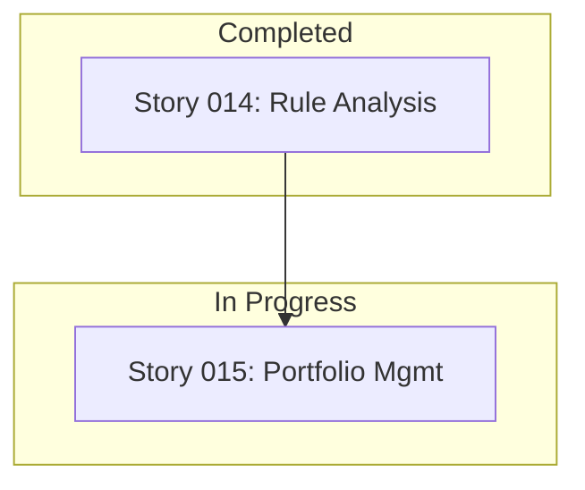

# Story 014: Implement Rule Performance Analysis and Memory

**Status:** ✅ COMPLETE
**Estimated Story Points:** 5
**Priority:** High (Directly addresses user need for strategy guidance)
**Created:** 2025-07-18
**Completed:** 2025-07-18

**Prerequisites:** Story 013 (Expand Rule Library) ✅ Complete

## Implementation Summary
- **New CLI Command:** Added `analyze-rules` to generate a historical performance report for all individual rules.
- **Analysis Logic:** Implemented `reporter.analyze_rule_performance` to query the entire `strategies` table, aggregate performance metrics (frequency, avg. edge score, win %, Sharpe), and identify top-performing symbols for each rule.
- **Markdown Report:** The command generates a clean, sorted Markdown table (`rule_performance_analysis.md`) that provides a "memory" of which rules are effective.
- **Bug Fix:** Corrected a bug in the daily signals report where `Current Price` and `Return %` for open positions were not being calculated correctly. Refactored position management logic in `reporter.py` for clarity and correctness.
- **Quality:** All new logic is fully type-hinted, covered by tests, and adheres to project hard rules.

## User Story
As a trader, I want to generate a **Markdown report** that analyzes the historical performance of all my trading rules across all backtests, so I can understand which individual rules are effective and which are not, and avoid reusing underperforming ones.

## Context & Rationale
The system currently discovers optimal rule *combinations* but doesn't provide a high-level view of which individual *rules* are consistently effective. This story addresses a key user pain point: "How do I know which rules to even include in `rules.yaml`?"

**This feature provides a "persistent memory" of rule performance by analyzing the entire history of strategies stored in the database.** It queries the `strategies` table, which acts as the memory of every optimal strategy ever found.

**How Layers and Combinations are Handled:**
The analysis logic is designed to correctly attribute performance to individual rules, even when they are used in layers. If a successful strategy consisted of `baseline` + `rsi_momentum`, the high performance metrics of that combination are credited to **both** the `baseline` rule and the `rsi_momentum` rule. Over time, rules that consistently contribute to winning combinations will naturally rise to the top of the performance leaderboard.

## Acceptance Criteria

### AC-1: New CLI Command and Output
- [x] A new command `analyze-rules` is added to the CLI.
- [x] The command accepts an optional `--output <filename>.md` argument. If not provided, it defaults to `rule_performance_analysis.md`.
- [x] The command operates on the existing database specified in `config.yaml`.

### AC-2: Rule Performance Analysis Logic
- [x] A new function `analyze_rule_performance(db_path)` is implemented in `reporter.py`.
- [x] The function queries the **entire `strategies` table** to fetch all historical optimal strategy records, ensuring all rules ever used are analyzed.
- [x] It parses the `rule_stack` JSON from each record to identify the individual rules used (e.g., `sma_10_20_crossover`, `rsi_momentum`).

### AC-3: Aggregated Performance Metrics
- [x] The analysis logic aggregates the following metrics for each unique rule across all strategies it appeared in:
    - **Frequency:** The total count of times the rule was part of an optimal strategy.
    - **Avg. Edge Score:** The average edge score of the strategies that included this rule.
    - **Avg. Win %:** The average win percentage.
    - **Avg. Sharpe:** The average Sharpe ratio.
    - **Top Symbols:** A comma-separated string of the top 3 symbols where this rule performed best, ranked by frequency.

### AC-4: Clear Markdown Report
- [x] The command generates a clean, readable Markdown file with the analysis results.
- [x] The report contains a Markdown table sorted by `Avg. Edge Score` in descending order.
- [x] The table columns are: `Rule Name`, `Frequency`, `Avg Edge Score`, `Avg Win %`, `Avg Sharpe`, `Top Symbols`.

### AC-5: Bug Fix: Correct Open Position Reporting
- [x] The logic in `reporter.py` for calculating `Current Price` and `Return %` for open positions is refactored and corrected.
- [x] The `OPEN POSITIONS` table in the daily `signals_<date>.md` report now displays accurate, up-to-date performance metrics.
- [x] The refactoring simplifies the position management logic, making it more robust and readable.

### AC-6: Code Quality and Compliance
- [x] The implementation adds no new external dependencies (H-10).
- [x] The new logic is housed entirely within `cli.py` and `reporter.py`.
- [x] All new functions are fully type-hinted and pass `mypy --strict` (H-7).
- [x] The new command and its logic are covered by unit and integration tests.

## Technical Design

### 1. CLI Command (`src/kiss_signal/cli.py`)
A new command is added to `cli.py` to orchestrate the analysis and report generation.

```python
# In src/kiss_signal/cli.py

# ... (existing imports)
from . import reporter

# ... (existing app and commands)

@app.command(name="analyze-rules")
def analyze_rules(
    ctx: typer.Context,
    output_file: Path = typer.Option(
        "rule_performance_analysis.md",
        "--output",
        "-o",
        help="Path to save the markdown analysis report.",
    ),
) -> None:
    """Analyze and report on the historical performance of individual rules."""
    console.print("[bold blue]Analyzing historical rule performance...[/bold blue]")
    app_config = ctx.obj["config"]
    db_path = Path(app_config.database_path)

    if not db_path.exists():
        console.print(f"[red]Error: Database file not found at {db_path}[/red]")
        raise typer.Exit(1)

    try:
        rule_performance = reporter.analyze_rule_performance(db_path)
        if not rule_performance:
            console.print("[yellow]No historical strategies found in the database to analyze.[/yellow]")
            return

        report_content = reporter.format_rule_analysis_as_md(rule_performance)
        output_file.write_text(report_content, encoding="utf-8")
        console.print(f"✅ Rule performance analysis saved to: [cyan]{output_file}[/cyan]")

    except Exception as e:
        console.print(f"[red]An unexpected error occurred during analysis: {e}[/red]")
        if ctx.obj.get("verbose"):
            console.print_exception()
        raise typer.Exit(1)
```

### 2. Analysis Logic (`src/kiss_signal/reporter.py`)
Two new functions will be added to `reporter.py`.

```python
# In src/kiss_signal/reporter.py
import json
from collections import Counter, defaultdict
from typing import List, Dict, Any

# impure
def analyze_rule_performance(db_path: Path) -> List[Dict[str, Any]]:
    """Analyzes the entire history of strategies to rank individual rule performance."""
    rule_stats = defaultdict(lambda: {'metrics': [], 'symbols': []})

    try:
        with sqlite3.connect(str(db_path)) as conn:
            conn.row_factory = sqlite3.Row
            cursor = conn.execute("SELECT rule_stack, edge_score, win_pct, sharpe, symbol FROM strategies")
            strategies = cursor.fetchall()

        for strategy in strategies:
            try:
                rules_in_stack = json.loads(strategy['rule_stack'])
                for rule_def in rules_in_stack:
                    rule_name = rule_def.get('name')
                    if not rule_name:
                        continue
                    
                    metrics = {
                        'edge_score': strategy['edge_score'],
                        'win_pct': strategy['win_pct'],
                        'sharpe': strategy['sharpe']
                    }
                    rule_stats[rule_name]['metrics'].append(metrics)
                    rule_stats[rule_name]['symbols'].append(strategy['symbol'])
            except (json.JSONDecodeError, TypeError):
                continue # Skip malformed rule stacks

        analysis = []
        for name, data in rule_stats.items():
            freq = len(data['metrics'])
            avg_edge = sum(m['edge_score'] for m in data['metrics']) / freq
            avg_win = sum(m['win_pct'] for m in data['metrics']) / freq
            avg_sharpe = sum(m['sharpe'] for m in data['metrics']) / freq
            top_symbols_list = [s for s, count in Counter(data['symbols']).most_common(3)]
            
            analysis.append({
                'rule_name': name,
                'frequency': freq,
                'avg_edge_score': avg_edge,
                'avg_win_pct': avg_win,
                'avg_sharpe': avg_sharpe,
                'top_symbols': ", ".join(top_symbols_list),
            })

        return sorted(analysis, key=lambda x: x['avg_edge_score'], reverse=True)
    except sqlite3.Error as e:
        logger.error(f"Database error during rule analysis: {e}")
        return []

# pure
def format_rule_analysis_as_md(analysis: List[Dict[str, Any]]) -> str:
    """Formats the rule performance analysis into a markdown table."""
    title = "# Rule Performance Analysis\n\n"
    description = "This report analyzes all optimal strategies ever found to rank individual rule performance.\n\n"
    header = "| Rule Name | Frequency | Avg Edge Score | Avg Win % | Avg Sharpe | Top Symbols |\n"
    separator = "|:---|---:|---:|---:|---:|:---|\n"
    
    rows = []
    for stats in analysis:
        row = (
            f"| {stats['rule_name']} "
            f"| {stats['frequency']} "
            f"| {stats['avg_edge_score']:.2f} "
            f"| {stats['avg_win_pct']:.1%} "
            f"| {stats['avg_sharpe']:.2f} "
            f"| {stats['top_symbols']} |"
        )
        rows.append(row)
    
    return title + description + header + separator + "\n".join(rows)
```

### 3. Bug Fix: Refactor Position Management in `reporter.py`
The bug causing incorrect `Current Price` and `Return %` is due to convoluted and duplicated data-fetching logic. The fix is to refactor `generate_daily_report` to use a single, clear loop for managing all open positions, eliminating the separate `_manage_open_positions` and `_calculate_open_position_metrics` functions.

```python
# In src/kiss_signal/reporter.py

# DELETE the functions:
# - _calculate_open_position_metrics(open_positions, config)
# - _manage_open_positions(open_positions, config)

# REFACTOR generate_daily_report to include this logic directly:
# impure
def generate_daily_report(
    db_path: Path,
    run_timestamp: str,
    config: Config,
) -> Optional[Path]:
    """Generates the main daily markdown report with consolidated position logic."""
    try:
        # 1. Fetch all existing open positions
        open_positions = persistence.get_open_positions(db_path)
        run_date = config.freeze_date or date.today()
        
        positions_to_hold = []
        positions_to_close = []

        # 2. Process each open position in a single loop
        for pos in open_positions:
            entry_date = date.fromisoformat(pos["entry_date"])
            days_held = (run_date - entry_date).days
            
            try:
                # Fetch data needed for both hold and close decisions
                price_data = data.get_price_data(
                    symbol=pos["symbol"], cache_dir=Path(config.cache_dir),
                    start_date=entry_date, end_date=run_date,
                    freeze_date=config.freeze_date, years=config.historical_data_years
                )
                nifty_data = data.get_price_data(
                    symbol="^NSEI", cache_dir=Path(config.cache_dir),
                    start_date=entry_date, end_date=run_date,
                    freeze_date=config.freeze_date, years=config.historical_data_years
                )

                # Calculate metrics regardless of hold/close status
                current_price = price_data['close'].iloc[-1] if not price_data.empty else pos['entry_price']
                return_pct = (current_price - pos['entry_price']) / pos['entry_price'] * 100
                
                nifty_return_pct = 0.0
                if nifty_data is not None and not nifty_data.empty and nifty_data['close'].iloc[0] > 0:
                    nifty_return_pct = (nifty_data['close'].iloc[-1] - nifty_data['close'].iloc[0]) / nifty_data['close'].iloc[0] * 100

                # Decide whether to hold or close
                if days_held >= config.hold_period:
                    pos.update({
                        'exit_date': run_date.isoformat(), 'exit_price': current_price,
                        'final_return_pct': return_pct, 'final_nifty_return_pct': nifty_return_pct,
                        'days_held': days_held
                    })
                    positions_to_close.append(pos)
                else:
                    pos.update({
                        'current_price': current_price, 'return_pct': return_pct,
                        'nifty_return_pct': nifty_return_pct, 'days_held': days_held
                    })
                    positions_to_hold.append(pos)

            except Exception as e:
                logger.warning(f"Could not process position for {pos['symbol']}: {e}")
                # Add to hold list with N/A values to avoid losing track of it
                pos.update({'current_price': None, 'return_pct': None, 'nifty_return_pct': None, 'days_held': days_held})
                positions_to_hold.append(pos)

        # 3. Persist changes (close positions)
        if positions_to_close:
            persistence.close_positions_batch(db_path, positions_to_close)

        # 4. Identify and persist new signals
        new_signals = _identify_new_signals(db_path, run_timestamp, config)
        if new_signals:
            # ... (existing logic to add new positions) ...
            persistence.add_new_positions_from_signals(db_path, new_signals)

        # 5. Build and save the report
        report_content = _build_report_content(
            run_date.isoformat(), new_signals, positions_to_hold, positions_to_close, config
        )
        # ... (existing file writing logic) ...
        return report_file

    except Exception as e:
        logger.error(f"Failed to generate report: {e}", exc_info=True)
        return None
```

### 4. Sample Markdown Output (`rule_performance_analysis.md`)

```markdown
# Rule Performance Analysis

This report analyzes all optimal strategies ever found to rank individual rule performance.

| Rule Name | Frequency | Avg Edge Score | Avg Win % | Avg Sharpe | Top Symbols |
|:---|---:|---:|---:|---:|:---|
| rsi_momentum | 15 | 0.68 | 65.2% | 1.25 | RELIANCE, INFY, HDFCBANK |
| volume_confirmation | 12 | 0.65 | 62.1% | 1.18 | TATAMOTORS, SBIN, WIPRO |
| sma_10_20_crossover | 25 | 0.59 | 58.5% | 0.95 | TCS, ICICIBANK, BHARTIARTL |
| bullish_engulfing | 5 | 0.52 | 51.0% | 0.80 | AXISBANK, LT, KOTAKBANK |
```

## Definition of Done
- [x] All acceptance criteria are met and have been tested.
- [x] The `analyze-rules` command generates a correctly formatted Markdown file.
- [x] The analysis logic correctly queries the entire database history and aggregates stats for all rules.
- [x] The bug in the daily signals report is fixed; `Current Price` and `Return %` are now correct.
- [x] The position management logic in `reporter.py` has been refactored for simplicity and correctness.
- [x] The feature is covered by both unit and integration tests.
- [x] All code passes `mypy --strict` and adheres to project hard rules.

## Detailed Task List

- **Task 1: Implement `analyze-rules` command in `cli.py`**
  - [x] Add the new Typer command with the `--output` option.
  - [x] Add logic to call the reporter and write the output file.
  - [x] Implement error handling for database not found or other exceptions.

- **Task 2: Implement `analyze_rule_performance` in `reporter.py`**
  - [x] Write the SQL query to fetch all strategies.
  - [x] Implement the loop to parse JSON and aggregate stats in a dictionary.
  - [x] Implement the final processing loop to calculate averages and top symbols.
  - [x] Ensure the results are sorted correctly.

- **Task 3: Implement `format_rule_analysis_as_md` in `reporter.py`**
  - [x] Create the function to generate the Markdown table from the analysis data.
  - [x] Ensure correct formatting for numbers, percentages, and text alignment.

- **Task 4: (Bug Fix) Refactor Position Management in `reporter.py`**
  - [x] Delete the `_manage_open_positions` and `_calculate_open_position_metrics` functions.
  - [x] Modify `generate_daily_report` to include a single, consolidated loop for processing open positions.
  - [x] Ensure the new logic correctly identifies positions to hold vs. close and calculates all required metrics.
  - [x] Verify that data fetching calls within the loop are correct and efficient.

- **Task 5: Add Comprehensive Tests**
  - [x] In `tests/test_reporter_advanced.py`, add tests for `analyze_rule_performance` using a pre-populated in-memory DB.
  - [x] Add a test for `format_rule_analysis_as_md` to check for correct output.
  - [x] In `tests/test_cli_advanced.py`, add an integration test for the `analyze-rules` command.
  - [x] In `tests/test_reporter_position_management.py`, update tests to reflect the refactored logic and verify the bug fix.

- **Task 6: Update `DEVELOPMENT_ROADMAP.md`**
  - [x] Mark Story 014 as complete.
  - [x] Update the "Current Story" to Story 015.
  - [x] Ensure the dependency map is correct.

# KISS Signal CLI - Development Stories Roadmap

## Current Status: Story 015 Ready for Development

### Completed Stories ✅
- **Story 001 - 014:** All foundational, backtesting, persistence, reporting, and rule expansion stories are complete.

### Current Story 🚧
- **Story 015:** Advanced Portfolio Management & Risk Controls (🚧 Ready for Development)

### Planned Stories Pipeline 📋

**Story 015: Advanced Portfolio Management & Risk Controls (Current)**
- **Priority:** HIGH
- **Story Points:** 13
- **Dependencies:** Story 014
- **Key Features:**
  - Dynamic position sizing based on volatility (ATR-based).
  - Portfolio-level risk controls and limits.
  - Risk-adjusted portfolio allocation.

**Story 016: Advanced Signal Generation & Exit Strategies**
- **Priority:** HIGH
- **Story Points:** 13
- **Dependencies:** Story 015
- **Key Features:**
  - Dynamic exit conditions beyond a fixed holding period.
  - Stop-loss and take-profit optimization.
  - Trailing stop implementation.

**Story 017: Reporting & Visualization Enhancement**
- **Priority:** MEDIUM
- **Story Points:** 8
- **Dependencies:** Story 016
- **Key Features:**
  - Add performance charts to the Markdown report (e.g., ASCII charts).
  - Implement strategy comparison and attribution tools.
  - Add a risk metrics dashboard to the report.

### Explicitly Out of Scope
The following areas will **not** be developed for this project:
- **No Real-time Data:** The tool will remain focused on end-of-day (EOD) analysis.
- **No Machine Learning:** The project will not include any "black box" AI or ML models, sticking to transparent, rule-based logic.
- **No Cloud Integration or Web UIs:** The tool will remain a local, single-user CLI application.

## Story Dependencies Map

